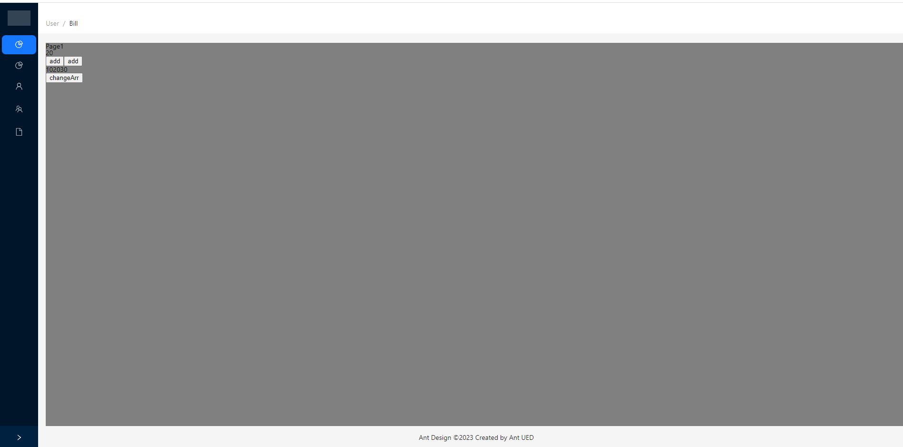
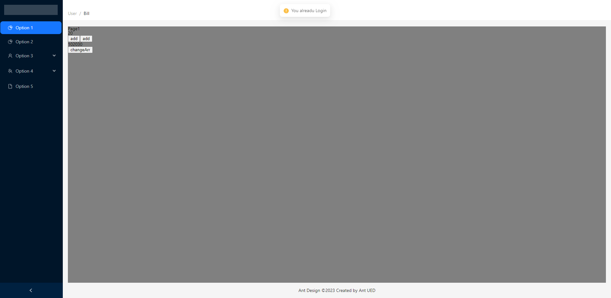

## **Backstage-management-system**

**This one is a personal practice project for me, Universal back-office management system.** 

This project is a front-end SPA.

Developed in modular, component-based and engineering mode, function includes user login,Routing Guards,captcha.

Front-end (main technology stack): React+Redux+TypeScript+Vite+Ant-design.

This project was my first project developed with TypeScript+React, which made me understand the benefits of data type rigor.

UI

     
    

     
    

     
    

     
    

### Summary

This project made me understand the advantages of TypeScript+React, multiple ways to achieve routing, how to achieve route guard, and CAPTCHA function.